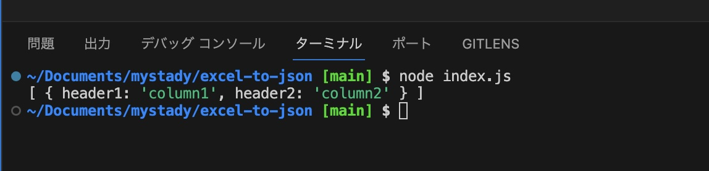
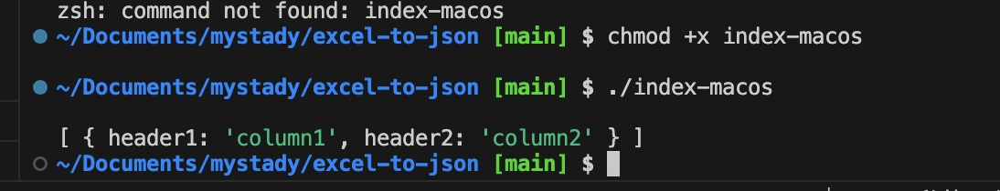

# プロジェクトの概要
このプロジェクトは、Excelファイルを読み込み、その内容をJSONファイルに変換するNode.jsアプリケーションです。
pkgを使用して、このアプリケーションを各プラットフォーム（Linux、macOS、Windows）用の実行可能ファイルに変換する方法も示します。


## 前提条件

このプログラムを実行するには、Node.jsがインストールされている必要があります。
また、プログラムの実行にはsample.xlsxファイルが必要です。


## 実行方法

### Node.jsで直接実行する場合
リポジトリのルートにsample.xlsxファイルを配置します。

以下のコマンドを実行して、アプリケーションを起動します。

```bash
node index.js

```

実行結果の例：




### pkgを使用してパッケージ化する場合

pkgを使用して、このNode.jsアプリケーションを各プラットフォーム（Linux、macOS、Windows）用の実行可能ファイルに変換します。pkgで生成された実行ファイルは、Node.jsのランタイムを内包しているため、Node.jsがインストールされていない環境でも実行することができます。

1. 以下のコマンドを実行して、プロジェクトをパッケージ化します。

```bash
pkg index.js
```

これにより、以下のファイルが生成されます。
- index-linux
- index-macos
- index-win.exe

macOSでの実行方法
1. 生成されたindex-macosファイルに実行権限を付与します。
```bash
chmod +x index-macos

```

2. 以下のコマンドを実行して、アプリケーションを起動します。

```bash
./index-macos
```




### メモ

- pkg　ライブラリをインストール:
```bash
npm install -g pkg
```
インストールするだけで、他の設定は不要

- xlsx ライブラリをインストール:
```bash
npm install xlsx
```